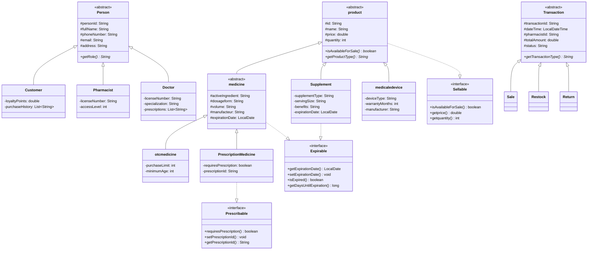
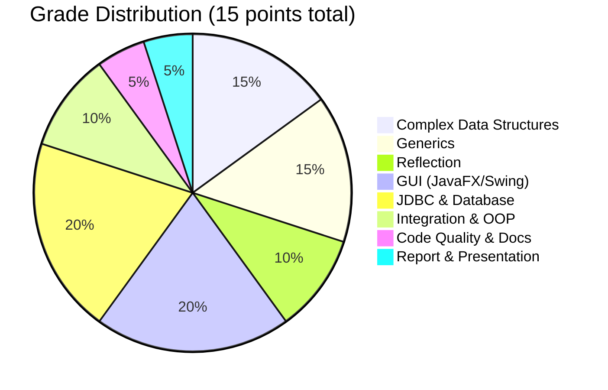

# 🏥 Pharmacy Management System — S2 Extension Walkthrough

## 1. Current Project Analysis (S1 — What You Have)

### Architecture Overview



### File Structure

| Package                                                                                                                        | Files                                                                                                                                                                                                                                                                                                                                                                                                                                                                                                                                                                                                                                                                                                                                                                                                                                                              | Purpose                                                                                                                                                                                                                                                                                                                                                                                                                                                                                                                                                                                                                                                                                                                                                                |
| ------------------------------------------------------------------------------------------------------------------------------ | ------------------------------------------------------------------------------------------------------------------------------------------------------------------------------------------------------------------------------------------------------------------------------------------------------------------------------------------------------------------------------------------------------------------------------------------------------------------------------------------------------------------------------------------------------------------------------------------------------------------------------------------------------------------------------------------------------------------------------------------------------------------------------------------------------------------------------------------------------------------ | ---------------------------------------------------------------------------------------------------------------------------------------------------------------------------------------------------------------------------------------------------------------------------------------------------------------------------------------------------------------------------------------------------------------------------------------------------------------------------------------------------------------------------------------------------------------------------------------------------------------------------------------------------------------------------------------------------------------------------------------------------------------------- |
| `com.pharmacy`                                                                                                                 | [Main.java](file:///c:/Users/ELITEBOOK%20HP%20840%20G%208/Phrmacy/Phrmacy-java/src/com/pharmacy/Main.java)                                                                                                                                                                                                                                                                                                                                                                                                                                                                                                                                                                                                                                                                                                                                                         | Entry point, console menu system, login                                                                                                                                                                                                                                                                                                                                                                                                                                                                                                                                                                                                                                                                                                                                |
| `com.pharmacy.models.products`                                                                                                 | [product](file:///c:/Users/ELITEBOOK%20HP%20840%20G%208/Phrmacy/Phrmacy-java/src/com/pharmacy/models/products/product.java#5-65), [medicine](file:///c:/Users/ELITEBOOK%20HP%20840%20G%208/Phrmacy/Phrmacy-java/src/com/pharmacy/models/products/medicine.java#7-96), [otcmedicine](file:///c:/Users/ELITEBOOK%20HP%20840%20G%208/Phrmacy/Phrmacy-java/src/com/pharmacy/models/products/otcmedicine.java#5-50), [PrescriptionMedicine](file:///c:/Users/ELITEBOOK%20HP%20840%20G%208/Phrmacy/Phrmacy-java/src/com/pharmacy/models/products/PrescriptionMedicine.java#5-47), [Supplement](file:///c:/Users/ELITEBOOK%20HP%20840%20G%208/Phrmacy/Phrmacy-java/src/com/pharmacy/models/products/Supplement.java#5-75), [medicaledevice](file:///c:/Users/ELITEBOOK%20HP%20840%20G%208/Phrmacy/Phrmacy-java/src/com/pharmacy/models/products/medicaledevice.java#5-56) | Product class hierarchy (6 classes)                                                                                                                                                                                                                                                                                                                                                                                                                                                                                                                                                                                                                                                                                                                                    |
| `com.pharmacy.models.persons`                                                                                                  | [Person](file:///c:/Users/ELITEBOOK%20HP%20840%20G%208/Phrmacy/Phrmacy-java/src/com/pharmacy/models/persons/Person.java#2-83), [Customer](file:///c:/Users/ELITEBOOK%20HP%20840%20G%208/Phrmacy/Phrmacy-java/src/com/pharmacy/models/persons/Customer.java#6-58), [Pharmacist](file:///c:/Users/ELITEBOOK%20HP%20840%20G%208/Phrmacy/Phrmacy-java/src/com/pharmacy/models/persons/Pharmacist.java#5-66), [Doctor](file:///c:/Users/ELITEBOOK%20HP%20840%20G%208/Phrmacy/Phrmacy-java/src/com/pharmacy/models/persons/Doctor.java#7-55)                                                                                                                                                                                                                                                                                                                             | Person hierarchy (4 classes)                                                                                                                                                                                                                                                                                                                                                                                                                                                                                                                                                                                                                                                                                                                                           |
| `com.pharmacy.models.transactions`                                                                                             | [Transaction](file:///c:/Users/ELITEBOOK%20HP%20840%20G%208/Phrmacy/Phrmacy-java/src/com/pharmacy/models/transactions/Transaction.java#3-64), [Sale](file:///c:/Users/ELITEBOOK%20HP%20840%20G%208/Phrmacy/Phrmacy-java/src/com/pharmacy/models/transactions/Sale.java#6-118), [Restock](file:///c:/Users/ELITEBOOK%20HP%20840%20G%208/Phrmacy/Phrmacy-java/src/com/pharmacy/models/transactions/Restock.java#5-87), [Return](file:///c:/Users/ELITEBOOK%20HP%20840%20G%208/Phrmacy/Phrmacy-java/src/com/pharmacy/models/transactions/Return.java#5-119)                                                                                                                                                                                                                                                                                                           | Transaction hierarchy (4 classes)                                                                                                                                                                                                                                                                                                                                                                                                                                                                                                                                                                                                                                                                                                                                      |
| `com.pharmacy.interfaces`                                                                                                      | [Sellable](file:///c:/Users/ELITEBOOK%20HP%20840%20G%208/Phrmacy/Phrmacy-java/src/com/pharmacy/interfaces/Sellable.java#4-14), [Expirable](file:///c:/Users/ELITEBOOK%20HP%20840%20G%208/Phrmacy/Phrmacy-java/src/com/pharmacy/interfaces/Expirable.java#5-18), [Prescribable](file:///c:/Users/ELITEBOOK%20HP%20840%20G%208/Phrmacy/Phrmacy-java/src/com/pharmacy/interfaces/Prescribable.java#3-13)                                                                                                                                                                                                                                                                                                                                                                                                                                                              | 3 domain interfaces                                                                                                                                                                                                                                                                                                                                                                                                                                                                                                                                                                                                                                                                                                                                                    |
| `com.pharmacy.exceptions`                                                                                                      | 5 custom exceptions                                                                                                                                                                                                                                                                                                                                                                                                                                                                                                                                                                                                                                                                                                                                                                                                                                                | [DrugInteraction](file:///c:/Users/ELITEBOOK%20HP%20840%20G%208/Phrmacy/Phrmacy-java/src/com/pharmacy/services/SaleService.java#223-246), [ExpiredProduct](file:///c:/Users/ELITEBOOK%20HP%20840%20G%208/Phrmacy/Phrmacy-java/src/com/pharmacy/exceptions/ExpiredProductException.java#3-8), [InsufficientStock](file:///c:/Users/ELITEBOOK%20HP%20840%20G%208/Phrmacy/Phrmacy-java/src/com/pharmacy/exceptions/InsufficientStockException.java#3-8), [InvalidPrescription](file:///c:/Users/ELITEBOOK%20HP%20840%20G%208/Phrmacy/Phrmacy-java/src/com/pharmacy/exceptions/InvalidPrescriptionException.java#3-8), [ProductNotFound](file:///c:/Users/ELITEBOOK%20HP%20840%20G%208/Phrmacy/Phrmacy-java/src/com/pharmacy/exceptions/ProductNotFoundException.java#3-8) |
| `com.pharmacy.services`                                                                                                        | [DataService](file:///c:/Users/ELITEBOOK%20HP%20840%20G%208/Phrmacy/Phrmacy-java/src/com/pharmacy/services/DataService.java#12-252), [ProductService](file:///c:/Users/ELITEBOOK%20HP%20840%20G%208/Phrmacy/Phrmacy-java/src/com/pharmacy/services/ProductService.java#11-281), [SaleService](file:///c:/Users/ELITEBOOK%20HP%20840%20G%208/Phrmacy/Phrmacy-java/src/com/pharmacy/services/SaleService.java#11-276), [InventoryService](file:///c:/Users/ELITEBOOK%20HP%20840%20G%208/Phrmacy/Phrmacy-java/src/com/pharmacy/services/InventoryService.java#11-136), [CustomerService](file:///c:/Users/ELITEBOOK%20HP%20840%20G%208/Phrmacy/Phrmacy-java/src/com/pharmacy/services/CustomerService.java#8-101)                                                                                                                                                     | Business logic (5 services)                                                                                                                                                                                                                                                                                                                                                                                                                                                                                                                                                                                                                                                                                                                                            |
| [data/](file:///c:/Users/ELITEBOOK%20HP%20840%20G%208/Phrmacy/Phrmacy-java/src/com/pharmacy/services/DataService.java#247-251) | [.txt](file:///c:/Users/ELITEBOOK%20HP%20840%20G%208/Phrmacy/Phrmacy-java/src/data/stock.txt) files                                                                                                                                                                                                                                                                                                                                                                                                                                                                                                                                                                                                                                                                                                                                                                | File-based persistence                                                                                                                                                                                                                                                                                                                                                                                                                                                                                                                                                                                                                                                                                                                                                 |

### What Works Today

- ✅ Console-based menu system with pharmacist login
- ✅ CRUD operations for products (4 types)
- ✅ Customer registration and management
- ✅ Sales processing with prescription validation
- ✅ Returns/refunds processing
- ✅ Inventory management (stock levels, low stock alerts, expiration checks, restocking)
- ✅ Drug interaction checking (same active ingredient)
- ✅ Loyalty points system
- ✅ File persistence ([.txt](file:///c:/Users/ELITEBOOK%20HP%20840%20G%208/Phrmacy/Phrmacy-java/src/data/stock.txt) files via [DataService](file:///c:/Users/ELITEBOOK%20HP%20840%20G%208/Phrmacy/Phrmacy-java/src/com/pharmacy/services/DataService.java#12-252))
- ✅ 5 custom exceptions with proper error handling
- ✅ OOP: abstract classes, inheritance, polymorphism, interfaces

---

## 2. S2 Extension — What We Need to Build

Below is the **complete game plan** organized by the 4 chapters, aligned with the project-specific requirements for **Project 12: Pharmacy Management System**.

---

### 📘 Chapter 1 — Complex Data Structures (15%)

**Current problem:** Everything uses `ArrayList` with linear O(n) lookups.

| What to Replace                                            | With What                                             | Why                                                         |
| ---------------------------------------------------------- | ----------------------------------------------------- | ----------------------------------------------------------- |
| `List<product> products` in Main                           | `HashMap<String, medicine>` keyed by barcode/INN code | O(1) product lookup by barcode instead of O(n) loop         |
| Expiration tracking (currently loops through all products) | `TreeMap<LocalDate, List<Product>>`                   | Sorted by date → proactive expiry alerts automatically      |
| `List<Transaction> transactions`                           | `LinkedList<SaleTransaction>`                         | Chronological sales history, efficient insertion            |
| No allergen tracking                                       | `HashSet<String>` per Customer                        | O(1) allergen lookup during dispensing                      |
| No drug interaction graph                                  | `JGraphT UndirectedGraph`                             | Nodes = drugs, edges = interactions — proper graph modeling |

**Specific implementation:**

1. **`HashMap<String, medicine>`** — Replace the products `ArrayList` with a `HashMap` for barcode-based O(1) access
2. **`TreeMap<LocalDate, List<product>>`** — For sorted expiration date tracking; iterate from earliest to find products expiring soon
3. **`LinkedList<SaleTransaction>`** — Replace plain list of sale transactions for chronological order and efficient add-to-end
4. **`HashSet<String>`** — Add `allergens` field to [Customer](file:///c:/Users/ELITEBOOK%20HP%20840%20G%208/Phrmacy/Phrmacy-java/src/com/pharmacy/models/persons/Customer.java#6-58), checked during dispensing
5. **`JGraphT` graph** — Drug interaction network where:
   - Vertices = medicine names
   - Edges = known interactions
   - Query before dispensing multi-drug sales

---

### 📗 Chapter 2 — Generics & Reflection (25%)

**2a. Generics (15%)**

| Component                                                                          | Description                                                                                                                                                                                                 |
| ---------------------------------------------------------------------------------- | ----------------------------------------------------------------------------------------------------------------------------------------------------------------------------------------------------------- |
| `StockManager<T extends product>`                                                  | Generic class managing inventory for medicines, devices, and supplements with type-safe operations                                                                                                          |
| `Expirable<T>` interface → make generic                                            | Generic interface with bounded type parameters for expiration management logic reused across perishable types                                                                                               |
| `PrescriptionValidator<T extends medicine>`                                        | Validates prescription requirements by medicine type                                                                                                                                                        |
| Generic method `<T extends Sellable> Receipt sell(T product, int qty, Customer c)` | In [SaleService](file:///c:/Users/ELITEBOOK%20HP%20840%20G%208/Phrmacy/Phrmacy-java/src/com/pharmacy/services/SaleService.java#11-276) — type-safe sell method that works across all sellable product types |

**2b. Reflection (10%)**

| Feature                   | Description                                                                                 |
| ------------------------- | ------------------------------------------------------------------------------------------- |
| Dynamic object inspection | Inspect any model object's fields and methods at runtime (useful for debugging/admin panel) |
| Dynamic class loading     | Load new product types or service classes dynamically from class name                       |
| Admin/Debug panel         | Use reflection to display all fields of a selected product or customer object in the GUI    |

---

### 📙 Chapter 3 — Graphical User Interface (20%)

**Replace the entire console interface with JavaFX/Swing.** Required screens:

| Screen                      | Key Features                                                                                          |
| --------------------------- | ----------------------------------------------------------------------------------------------------- |
| **Login**                   | Authentication form connected to DB, professional design                                              |
| **Main Dashboard**          | Navigation menu/tabs, today's sales count, products to order, upcoming expiries (30 days)             |
| **Sales Terminal**          | Barcode scanner simulation (text field), auto-fill product details, running total, payment processing |
| **Stock Dashboard**         | Product table with color badges: 🔴 red (out of stock), 🟠 orange (low), 🟡 yellow (near expiry)      |
| **Prescription Management** | Entry form with validity check, renewable prescription tracking                                       |
| **Drug Interaction Alert**  | Modal warning dialog when dispensed drug interacts with active prescription                           |
| **Customer Management**     | Registration, viewing, purchase history with date range filter                                        |
| **Charts**                  | At least one: `BarChart` / `LineChart` / `PieChart` for sales statistics                              |

**Design requirements:**

- Clean, organized, intuitive layout
- Consistent color scheme and typography
- Professional forms, tables, and dashboards
- Icons, spacing, and visual feedback
- Must look like a **real application**, not a prototype

---

### 📕 Chapter 4 — JDBC & Database (20%)

**Replace all [.txt](file:///c:/Users/ELITEBOOK%20HP%20840%20G%208/Phrmacy/Phrmacy-java/src/data/stock.txt) file persistence with a relational database (MySQL or SQLite).**

| Requirement                   | Details                                                                                                                                                                                               |
| ----------------------------- | ----------------------------------------------------------------------------------------------------------------------------------------------------------------------------------------------------- |
| **Database tables**           | `products`, [stock](file:///c:/Users/ELITEBOOK%20HP%20840%20G%208/Phrmacy/Phrmacy-java/src/com/pharmacy/models/transactions/Restock.java#5-87), `customers`, `sales`, `prescriptions`, `interactions` |
| **PreparedStatement**         | All queries must use `PreparedStatement` — NO string concatenation                                                                                                                                    |
| **Transaction**               | At least one JDBC transaction (commit/rollback) for a critical operation (e.g., sale processing)                                                                                                      |
| **Full GUI–DB connection**    | All CRUD operations read/write from the database                                                                                                                                                      |
| **Login**                     | Authentication form connected to the database                                                                                                                                                         |
| **Expiry alert query**        | `SELECT products WHERE expiry_date <= CURRENT_DATE + 30`                                                                                                                                              |
| **Interaction check**         | SQL JOIN on `interactions` table before finalizing multi-drug sales                                                                                                                                   |
| **Customer purchase history** | `TableView` with date range filter using parameterized query                                                                                                                                          |
| **Reorder suggestion**        | Triggered from UI when stock falls below defined threshold                                                                                                                                            |

**`schema.sql`** must include:

- Table creation DDL
- Sample data population (INSERT statements)

---

## 3. What Must NOT Change

> [!CAUTION]
> These S1 elements must be preserved and functional:

- All class hierarchies (abstract classes, interfaces, inheritance chains)
- All 5 custom exceptions (now thrown from GUI event handlers too)
- Object relationships (composition, aggregation, association)
- All mandatory S1 features (product CRUD, sales, returns, inventory, customers)

---

## 4. New Package Structure (Proposed)

```
com.pharmacy/
├── Main.java                          (modified — launches GUI instead of console)
├── models/
│   ├── persons/                       (preserved: Person, Customer, Pharmacist, Doctor)
│   ├── products/                      (preserved: product, medicine, otcmedicine, etc.)
│   └── transactions/                  (preserved: Transaction, Sale, Restock, Return)
├── interfaces/                        (preserved + extended: Sellable, Expirable, Prescribable)
├── exceptions/                        (preserved: all 5 exceptions)
├── services/                          (modified: ProductService, SaleService, etc.)
├── generics/                          [NEW]
│   ├── StockManager.java              (generic class)
│   ├── PrescriptionValidator.java     (generic class)
│   └── Repository.java                (generic base if needed)
├── datastructures/                    [NEW]
│   ├── DrugInteractionGraph.java      (JGraphT graph)
│   ├── ProductCatalog.java            (HashMap-based catalog)
│   └── ExpirationTracker.java         (TreeMap-based tracker)
├── reflection/                        [NEW]
│   └── ObjectInspector.java           (dynamic inspection utility)
├── db/                                [NEW]
│   ├── DatabaseConnection.java        (JDBC connection manager)
│   ├── ProductDAO.java                (data access object)
│   ├── CustomerDAO.java
│   ├── SaleDAO.java
│   └── StockDAO.java
└── gui/                               [NEW]
    ├── LoginScreen.java
    ├── MainDashboard.java
    ├── SalesTerminal.java
    ├── StockDashboard.java
    ├── PrescriptionForm.java
    ├── CustomerPanel.java
    └── StatisticsChart.java
```

---

## 5. Deliverables Checklist

| Deliverable                                                                               | Status | Notes                                   |
| ----------------------------------------------------------------------------------------- | ------ | --------------------------------------- |
| Complete source code in packages                                                          | 🔲     | Must include all S1 + S2 additions      |
| `schema.sql`                                                                              | 🔲     | DB creation + sample data               |
| [README.md](file:///c:/Users/ELITEBOOK%20HP%20840%20G%208/Phrmacy/Phrmacy-java/README.md) | 🔲     | Compile, configure DB, run instructions |
| PDF report                                                                                | 🔲     | Extended from S1 with all S2 sections   |
| GUI demo                                                                                  | 🔲     | Must run live during presentation       |

---

## 6. Evaluation Weight Mapping



---

## 7. Recommended Build Order

| Phase       | What                                                                                       | Est. Effort |
| ----------- | ------------------------------------------------------------------------------------------ | ----------- |
| **Phase 1** | `schema.sql` + `DatabaseConnection` + DAO classes (JDBC foundation)                        | High        |
| **Phase 2** | Complex data structures (`HashMap`, `TreeMap`, `LinkedList`, `HashSet`, `JGraphT`)         | Medium      |
| **Phase 3** | Generics (`StockManager<T>`, `Expirable<T>`, `PrescriptionValidator<T>`, generic `sell()`) | Medium      |
| **Phase 4** | Reflection utility (`ObjectInspector`)                                                     | Low         |
| **Phase 5** | GUI screens (Login → Dashboard → Sales → Stock → Prescriptions → Customers → Charts)       | High        |
| **Phase 6** | Wire everything together (GUI ↔ Services ↔ DAO ↔ DB)                                       | High        |
| **Phase 7** | Polish, README, report, testing                                                            | Medium      |

> [!IMPORTANT]
> **Start with the database layer (Phase 1)** because everything else depends on it. The GUI (Phase 5) is the most visible part and carries 20% weight — invest serious effort in design quality.
